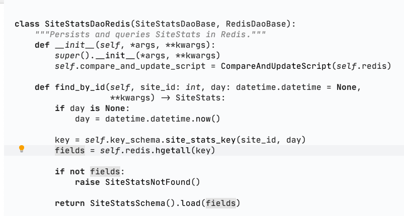
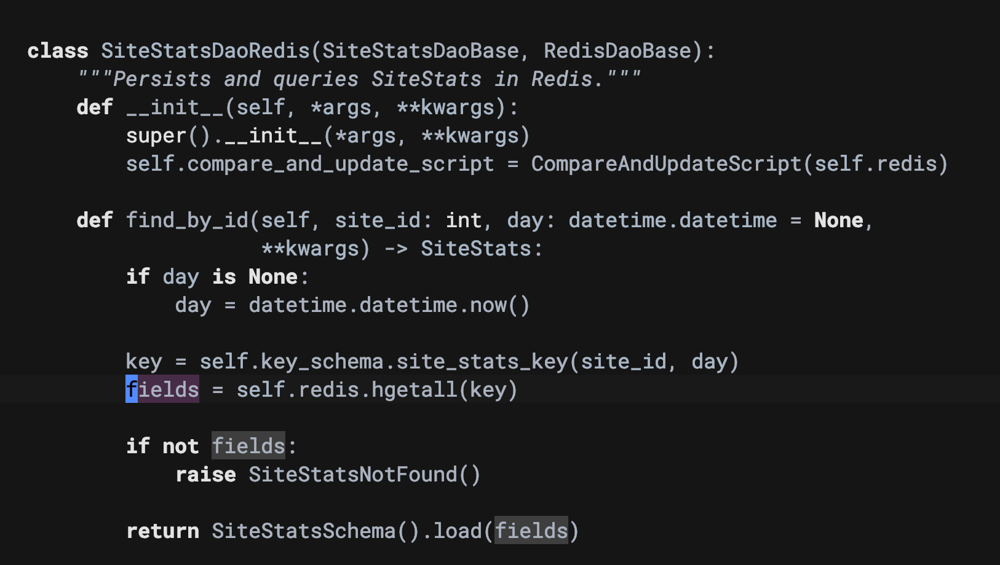
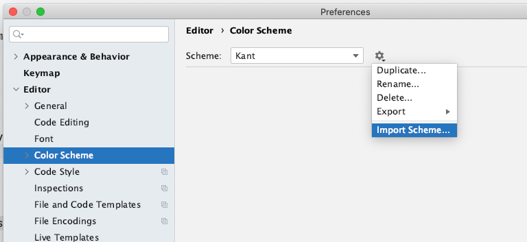

# Kant

> There is ... only a single categorical imperative and it is this: Act only on that maxim through which you can at the same time will that it should become a universal law

-- Immanuel Kant, Metaphysics of Morals (1797), Ch. 11

## A Monochrome Color Scheme

Kant is a monochrome color scheme for JetBrains editors like Intellij IDEA Ultimate and PyCharm.

It is based on the luxurious monochrome color schemes Verdandi and Verdandi Alter for Visual Studio Code.

## Screenshots

Kant:

Kant Dark:

## How to Install

Both color schemes are provided as ".icls" files, which you can import into an Intellij editor from the Settings panel.

This is what doing that looks like on a Mac:

